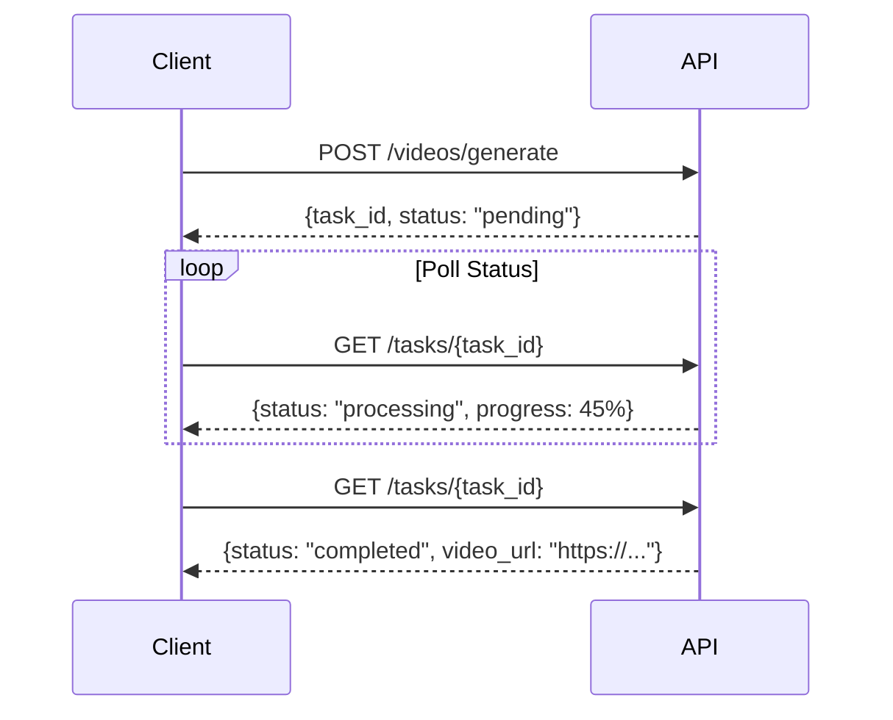

# Video Generation APIs Documentation

This document describes the Video Generation API endpoints using Veo3 for image-to-video conversion.

## Overview

The Video APIs provide:
- **Image-to-Video**: Convert static images into animated videos
- **Async Processing**: Submit tasks and poll for completion
- **Customizable Parameters**: Duration, FPS, resolution, camera motion
- **Prompt-Guided**: Control video generation with text prompts

## Base URLs

- **REST API**: `http://localhost:8000/api/v1/videos`
- **OpenAI Compatible**: `http://localhost:8000/v1/videos`

## Workflow

Video generation is **asynchronous**:

1. **Submit**: POST request returns `task_id`
2. **Poll**: GET status using `task_id`
3. **Download**: Get `video_url` when status is `completed`



## Endpoints

### 1. Generate Video (Async)

Submit a video generation task.

**Endpoint**: `POST /api/v1/videos/generate`

**Request Body**:
```json
{
  "image": "base64_encoded_image_or_url",
  "prompt": "Gentle camera pan across the scene",
  "duration": 5,
  "fps": 30,
  "resolution": "1920x1080",
  "motion_strength": 0.5,
  "camera_motion": "pan",
  "optimize_prompt": false
}
```

**Parameters**:
- `image` (required): Base64 encoded image or URL
- `prompt` (optional): Video generation guidance
- `duration` (optional): Video duration in seconds (1-10)
  - Note: If not specified, Veo3 decides automatically
- `fps` (optional): Frames per second (24-60, default: 30)
- `resolution` (optional): Video resolution (default: "1920x1080")
- `motion_strength` (optional): Motion intensity (0.0-1.0, default: 0.5)
- `camera_motion` (optional): Camera movement type
  - `pan`: Horizontal movement
  - `tilt`: Vertical movement
  - `zoom`: Zoom in/out
  - `static`: No camera movement
- `optimize_prompt` (optional): Auto-optimize prompt with LLM

**Response**:
```json
{
  "task_id": "vid_abc123def456",
  "status": "pending",
  "message": "Video generation task submitted. Poll /api/v1/tasks/vid_abc123def456 for status."
}
```

**Example (curl)**:
```bash
curl -X POST http://localhost:8000/api/v1/videos/generate \
  -H "Content-Type: application/json" \
  -d '{
    "image": "https://example.com/image.jpg",
    "prompt": "A serene ocean scene with gentle waves",
    "duration": 5,
    "fps": 30
  }'
```

**Example (Python)**:
```python
import requests
import base64
import time

# Read and encode image
with open("input.jpg", "rb") as f:
    image_b64 = base64.b64encode(f.read()).decode()

# Submit video generation
response = requests.post(
    "http://localhost:8000/api/v1/videos/generate",
    json={
        "image": image_b64,
        "prompt": "Camera slowly pans across the landscape",
        "duration": 5,
        "fps": 30,
        "motion_strength": 0.6
    }
)

task_info = response.json()
task_id = task_info["task_id"]
print(f"Task submitted: {task_id}")

# Poll for completion
while True:
    status_response = requests.get(
        f"http://localhost:8000/api/v1/tasks/{task_id}"
    )
    status = status_response.json()
    
    print(f"Status: {status['status']}, Progress: {status['progress']}%")
    
    if status['status'] == 'completed':
        video_url = status['result']['result']['video_url']
        print(f"Video ready: {video_url}")
        break
    elif status['status'] == 'failed':
        print(f"Failed: {status['error']}")
        break
    
    time.sleep(5)  # Poll every 5 seconds
```

### 2. Get Video Status (Deprecated)

**Note**: Use `/api/v1/tasks/{task_id}` instead.

**Endpoint**: `GET /api/v1/videos/{video_id}`

**Response**:
```json
{
  "task_id": "vid_abc123",
  "status": "processing",
  "progress": 45,
  "video_url": null,
  "error": null,
  "created_at": "2026-01-11T10:30:00Z",
  "updated_at": "2026-01-11T10:30:15Z"
}
```

### 3. Generate Video (OpenAI Compatible)

OpenAI-format video generation endpoint.

**Endpoint**: `POST /v1/videos`

**Request Body**:
```json
{
  "prompt": "A serene ocean scene with gentle waves",
  "input_reference": "base64_encoded_image_or_url",
  "size": "1920x1080",
  "seconds": 5,
  "model": "veo_3_1"
}
```

**Response**:
```json
{
  "id": "vid_abc123",
  "object": "video",
  "status": "pending",
  "progress": 0,
  "created": 1677652288,
  "video_url": null
}
```

**Example (Hypothetical OpenAI SDK)**:
```python
import openai
import time

openai.api_base = "http://localhost:8000/v1"
openai.api_key = "not-needed"

# Submit video generation
response = openai.Video.create(
    prompt="Gentle camera pan",
    input_reference=image_base64,
    size="1920x1080",
    seconds=5
)

video_id = response['id']

# Poll for completion
while True:
    status = openai.Video.retrieve(video_id)
    print(f"Status: {status['status']}, Progress: {status['progress']}%")
    
    if status['status'] == 'completed':
        print(f"Video URL: {status['video_url']}")
        break
    
    time.sleep(5)
```

### 4. Get Video Status (OpenAI)

**Endpoint**: `GET /v1/videos/{id}`

**Response**: Same as create response with updated status

### 5. Download Video (OpenAI)

**Endpoint**: `GET /v1/videos/{id}/content`

Returns a redirect (307) to the actual video URL.

## Configuration

Configure video service in `backend/.env`:

```bash
# Veo3 Configuration
VEO3_API_KEY=your_veo3_api_key_here
VEO3_BASE_URL=https://api.kuai.host
VEO3_ENDPOINT=/v1/videos
VEO3_MODEL=veo_3_1  # or veo_3_1-fast
VEO3_SKIP_UPLOAD=true

# Retry Configuration
VIDEO_GENERATION_MAX_RETRIES=3
VIDEO_GENERATION_RETRY_DELAY=5.0
VIDEO_GENERATION_RETRY_BACKOFF=2.0

# Concurrency
VIDEO_MAX_CONCURRENT=2
```

## Best Practices

### 1. Input Image Quality

Use high-quality input images for best results:

```python
# Generate high-quality image first
image_response = requests.post(
    "http://localhost:8000/api/v1/images/generate",
    json={
        "prompt": "A serene mountain landscape",
        "width": 1920,
        "height": 1080,
        "quality": "high"
    }
)

image_url = image_response.json()["image_url"]

# Then generate video
video_response = requests.post(
    "http://localhost:8000/api/v1/videos/generate",
    json={
        "image": image_url,
        "prompt": "Slow camera pan revealing the valley",
        "duration": 5
    }
)
```

### 2. Prompt Engineering

Use descriptive prompts for better control:

```
Bad: "Make it move"
Good: "Gentle camera pan from left to right, revealing the landscape slowly with smooth motion"
```

### 3. Duration Selection

Choose appropriate duration:
- **Short (1-3s)**: Quick transitions, social media
- **Medium (4-6s)**: Standard clips, storytelling
- **Long (7-10s)**: Cinematic shots, detailed scenes

### 4. Polling Strategy

Implement efficient polling:

```python
import time

def poll_video_status(task_id, max_wait=300):
    """Poll video status with exponential backoff"""
    poll_interval = 5  # Start with 5 seconds
    max_interval = 30  # Max 30 seconds between polls
    elapsed = 0
    
    while elapsed < max_wait:
        response = requests.get(
            f"http://localhost:8000/api/v1/tasks/{task_id}"
        )
        status = response.json()
        
        if status['status'] in ['completed', 'failed', 'cancelled']:
            return status
        
        print(f"Progress: {status['progress']}%")
        time.sleep(poll_interval)
        elapsed += poll_interval
        
        # Exponential backoff
        poll_interval = min(poll_interval * 1.5, max_interval)
    
    raise TimeoutError(f"Video generation timeout after {max_wait}s")
```

### 5. Error Handling

Handle different error types:

```python
try:
    response = requests.post(
        "http://localhost:8000/api/v1/videos/generate",
        json={"image": image_url, "duration": 5}
    )
    response.raise_for_status()
    
    task_id = response.json()["task_id"]
    
    # Poll for status
    result = poll_video_status(task_id)
    
    if result['status'] == 'completed':
        video_url = result['result']['result']['video_url']
        print(f"Success: {video_url}")
    elif result['status'] == 'failed':
        error = result.get('error', {})
        if 'content_policy' in error.get('message', '').lower():
            print("Content policy violation - adjust prompt")
        elif error.get('retryable'):
            print("Temporary error - retry")
        else:
            print(f"Permanent error: {error.get('message')}")
            
except requests.exceptions.HTTPError as e:
    print(f"HTTP Error: {e}")
except TimeoutError as e:
    print(f"Timeout: {e}")
```

## Task Status Reference

| Status | Description | Action |
|--------|-------------|--------|
| `pending` | Task queued | Keep polling |
| `processing` | Video generating | Keep polling, check progress |
| `completed` | Success | Get video_url from result |
| `failed` | Generation failed | Check error message |
| `cancelled` | User cancelled | Task terminated |

## Performance

- **Average Generation Time**: 30-90 seconds (depends on duration and resolution)
- **Max Concurrent**: Configured via `VIDEO_MAX_CONCURRENT` (recommended: 2-3)
- **Supported Resolutions**: 
  - 1920x1080 (Full HD)
  - 1280x720 (HD)
  - Other standard resolutions

## Error Types

### Content Policy Violation

```json
{
  "error": {
    "type": "VideoGenerationError",
    "message": "Content policy violation",
    "retryable": false
  }
}
```

**Solution**: Modify prompt or input image

### Audio Filtered

```json
{
  "error": {
    "type": "VideoGenerationError",
    "message": "Audio filtered",
    "retryable": false
  }
}
```

**Solution**: Adjust prompt text

### Temporary Errors

```json
{
  "error": {
    "type": "ServiceError",
    "message": "Service temporarily unavailable",
    "retryable": true
  }
}
```

**Solution**: Retry after delay

## Limitations

1. **Duration**: Maximum 10 seconds per video
2. **Concurrent Generation**: Limited by `VIDEO_MAX_CONCURRENT`
3. **Resolution**: Max 1920x1080
4. **File Size**: Large videos may take longer to generate
5. **Content Policy**: Some prompts/images may be rejected

## See Also

- [Image APIs](image_apis.md) - Generate input images
- [Task Management](task_management.md) - Task polling details
- [OpenAI Compatibility](openai_compatibility.md) - OpenAI SDK usage

