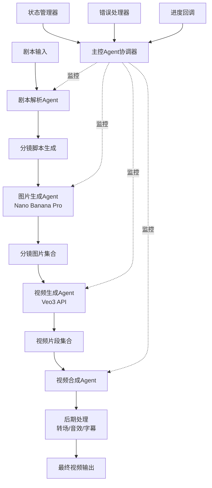

# AI短剧自动化生成系统开发教程（第1部分）
## 系统架构设计与环境准备

---

## 目录

1. [系统架构设计](#1-系统架构设计)
   - 1.1 [整体流程图](#11-整体流程图)
   - 1.2 [Agent架构设计](#12-agent架构设计)
   - 1.3 [技术选型说明](#13-技术选型说明)
2. [环境准备](#2-环境准备)
   - 2.1 [开发环境配置](#21-开发环境配置)
   - 2.2 [API密钥配置](#22-api密钥配置)
   - 2.3 [项目结构](#23-项目结构)

---

## 1. 系统架构设计

### 1.1 整体流程图

AI短剧自动化生成系统的核心流程包括从剧本输入到最终视频输出的完整链路。以下是系统的整体数据流：



**数据流详解：**

1. **输入阶段**：用户提供剧本文本（txt/json格式）
2. **解析阶段**：剧本解析Agent将文本转换为结构化数据（场景、角色、对话、镜头描述）
3. **图片生成阶段**：图片生成Agent调用Nano Banana Pro API，为每个分镜生成高质量图片
4. **视频生成阶段**：视频生成Agent调用Veo3 API，将静态图片转换为动态视频片段
5. **合成阶段**：视频合成Agent使用FFmpeg/MoviePy拼接所有片段
6. **后期处理阶段**：添加转场效果、背景音乐、字幕等
7. **输出阶段**：导出最终的完整短剧视频

---

### 1.2 Agent架构设计

系统采用**多Agent协作架构**，每个Agent负责特定的功能模块，通过主控Agent进行统一调度。

#### 1.2.1 Agent角色定义

```python
# Agent角色枚举
from enum import Enum

class AgentRole(Enum):
    """Agent角色定义"""
    SCRIPT_PARSER = "script_parser"           # 剧本解析Agent
    IMAGE_GENERATOR = "image_generator"       # 图片生成Agent
    VIDEO_GENERATOR = "video_generator"       # 视频生成Agent
    VIDEO_COMPOSER = "video_composer"         # 视频合成Agent
    ORCHESTRATOR = "orchestrator"             # 主控协调Agent
```

#### 1.2.2 Agent职责划分

| Agent名称 | 职责描述 | 输入 | 输出 |
|-----------|---------|------|------|
| **剧本解析Agent** | 解析剧本文本，生成结构化分镜脚本 | 原始剧本文本 | 分镜场景列表（JSON） |
| **图片生成Agent** | 调用Nano Banana Pro生成分镜图片 | 场景描述、风格参数 | 图片文件路径列表 |
| **视频生成Agent** | 调用Veo3将图片转换为视频片段 | 图片路径、场景配置 | 视频片段路径列表 |
| **视频合成Agent** | 拼接视频片段并进行后期处理 | 视频片段列表、音频、字幕 | 最终视频文件路径 |
| **主控Agent** | 协调所有Agent的执行，管理状态 | 用户配置、进度回调 | 执行结果、状态信息 |

#### 1.2.3 Agent基础架构

```python
from abc import ABC, abstractmethod
from typing import Any, Dict, Optional
from datetime import datetime
import logging

class BaseAgent(ABC):
    """Agent基类，定义所有Agent的通用接口"""

    def __init__(self, agent_id: str, config: Dict[str, Any]):
        """
        初始化Agent

        Args:
            agent_id: Agent唯一标识符
            config: Agent配置参数
        """
        self.agent_id = agent_id
        self.config = config
        self.logger = logging.getLogger(f"Agent.{agent_id}")
        self.state = AgentState.IDLE
        self.created_at = datetime.now()

    @abstractmethod
    async def execute(self, input_data: Any) -> Any:
        """
        执行Agent的核心任务

        Args:
            input_data: 输入数据

        Returns:
            处理后的输出数据
        """
        pass

    @abstractmethod
    async def validate_input(self, input_data: Any) -> bool:
        """
        验证输入数据的有效性

        Args:
            input_data: 待验证的输入数据

        Returns:
            验证是否通过
        """
        pass

    async def on_error(self, error: Exception) -> None:
        """
        错误处理钩子

        Args:
            error: 发生的异常
        """
        self.logger.error(f"Agent {self.agent_id} encountered error: {str(error)}")
        self.state = AgentState.ERROR

    async def on_complete(self, result: Any) -> None:
        """
        任务完成钩子

        Args:
            result: 执行结果
        """
        self.logger.info(f"Agent {self.agent_id} completed successfully")
        self.state = AgentState.COMPLETED

class AgentState(Enum):
    """Agent状态枚举"""
    IDLE = "idle"               # 空闲
    RUNNING = "running"         # 运行中
    WAITING = "waiting"         # 等待中
    COMPLETED = "completed"     # 已完成
    ERROR = "error"             # 错误状态
```

#### 1.2.4 Agent协作机制

Agent之间通过**消息队列**进行通信，主控Agent负责消息的路由和调度：

```python
import asyncio
from typing import Callable, Dict, List
from dataclasses import dataclass

@dataclass
class AgentMessage:
    """Agent间通信的消息格式"""
    sender_id: str          # 发送者Agent ID
    receiver_id: str        # 接收者Agent ID
    message_type: str       # 消息类型（task/result/error/status）
    payload: Any            # 消息内容
    timestamp: datetime     # 时间戳
    correlation_id: str     # 关联ID（用于追踪请求链路）

class MessageBus:
    """消息总线，负责Agent间的消息传递"""

    def __init__(self):
        self.subscribers: Dict[str, List[Callable]] = {}
        self.message_queue = asyncio.Queue()

    def subscribe(self, message_type: str, callback: Callable):
        """
        订阅特定类型的消息

        Args:
            message_type: 消息类型
            callback: 回调函数
        """
        if message_type not in self.subscribers:
            self.subscribers[message_type] = []
        self.subscribers[message_type].append(callback)

    async def publish(self, message: AgentMessage):
        """
        发布消息

        Args:
            message: 要发布的消息
        """
        await self.message_queue.put(message)

    async def start_processing(self):
        """启动消息处理循环"""
        while True:
            message = await self.message_queue.get()
            if message.message_type in self.subscribers:
                for callback in self.subscribers[message.message_type]:
                    await callback(message)
```

#### 1.2.5 状态管理策略

使用**状态机模式**管理整个生成流程的状态：

```python
from enum import Enum
from typing import Optional

class WorkflowState(Enum):
    """工作流状态"""
    INITIALIZED = "initialized"           # 已初始化
    PARSING_SCRIPT = "parsing_script"     # 解析剧本中
    GENERATING_IMAGES = "generating_images"  # 生成图片中
    GENERATING_VIDEOS = "generating_videos"  # 生成视频中
    COMPOSING_VIDEO = "composing_video"   # 合成视频中
    POST_PROCESSING = "post_processing"   # 后期处理中
    COMPLETED = "completed"               # 已完成
    FAILED = "failed"                     # 失败

class WorkflowStateManager:
    """工作流状态管理器"""

    def __init__(self):
        self.current_state = WorkflowState.INITIALIZED
        self.state_history = [(WorkflowState.INITIALIZED, datetime.now())]
        self.checkpoint_data = {}

    def transition_to(self, new_state: WorkflowState,
                     checkpoint: Optional[Dict] = None):
        """
        状态转换

        Args:
            new_state: 新状态
            checkpoint: 检查点数据（用于断点续传）
        """
        if self._is_valid_transition(self.current_state, new_state):
            self.current_state = new_state
            self.state_history.append((new_state, datetime.now()))

            if checkpoint:
                self.checkpoint_data[new_state.value] = checkpoint
        else:
            raise ValueError(f"Invalid state transition: {self.current_state} -> {new_state}")

    def _is_valid_transition(self, from_state: WorkflowState,
                            to_state: WorkflowState) -> bool:
        """验证状态转换是否合法"""
        valid_transitions = {
            WorkflowState.INITIALIZED: [WorkflowState.PARSING_SCRIPT],
            WorkflowState.PARSING_SCRIPT: [WorkflowState.GENERATING_IMAGES, WorkflowState.FAILED],
            WorkflowState.GENERATING_IMAGES: [WorkflowState.GENERATING_VIDEOS, WorkflowState.FAILED],
            WorkflowState.GENERATING_VIDEOS: [WorkflowState.COMPOSING_VIDEO, WorkflowState.FAILED],
            WorkflowState.COMPOSING_VIDEO: [WorkflowState.POST_PROCESSING, WorkflowState.FAILED],
            WorkflowState.POST_PROCESSING: [WorkflowState.COMPLETED, WorkflowState.FAILED],
        }

        return to_state in valid_transitions.get(from_state, [])

    def get_checkpoint(self, state: WorkflowState) -> Optional[Dict]:
        """获取特定状态的检查点数据"""
        return self.checkpoint_data.get(state.value)
```

#### 1.2.6 错误处理策略

实现**多层次错误处理机制**：

```python
import traceback
from typing import Type, Callable, Optional

class ErrorHandler:
    """统一错误处理器"""

    def __init__(self):
        self.error_handlers: Dict[Type[Exception], Callable] = {}
        self.retry_config = {
            'max_retries': 3,
            'backoff_factor': 2,
            'retry_exceptions': [ConnectionError, TimeoutError]
        }

    def register_handler(self, exception_type: Type[Exception],
                        handler: Callable):
        """
        注册特定异常的处理器

        Args:
            exception_type: 异常类型
            handler: 处理函数
        """
        self.error_handlers[exception_type] = handler

    async def handle_error(self, error: Exception,
                          context: Optional[Dict] = None) -> Any:
        """
        处理错误

        Args:
            error: 发生的异常
            context: 错误上下文信息

        Returns:
            处理结果（如重试、降级方案等）
        """
        error_type = type(error)

        # 查找匹配的错误处理器
        if error_type in self.error_handlers:
            return await self.error_handlers[error_type](error, context)

        # 默认错误处理：记录日志并抛出
        logging.error(f"Unhandled error: {error}")
        logging.error(f"Traceback: {traceback.format_exc()}")
        logging.error(f"Context: {context}")
        raise error

# 使用示例
async def handle_api_timeout(error: TimeoutError, context: Dict):
    """处理API超时错误"""
    retry_count = context.get('retry_count', 0)
    max_retries = context.get('max_retries', 3)

    if retry_count < max_retries:
        wait_time = 2 ** retry_count  # 指数退避
        await asyncio.sleep(wait_time)
        return {'action': 'retry', 'wait_time': wait_time}
    else:
        return {'action': 'fail', 'reason': 'Max retries exceeded'}
```

---

### 1.3 技术选型说明

#### 1.3.1 编程语言：Python 3.8+

**选择理由：**
- 丰富的AI/ML生态系统（NumPy、Pillow等）
- 优秀的异步编程支持（asyncio、aiohttp）
- 强大的视频处理库（MoviePy、FFmpeg-python）
- 简洁的语法，便于快速开发和迭代

#### 1.3.2 Agent框架选型

我们将实现**自定义轻量级Agent框架**，原因如下：

| 框架 | 优势 | 劣势 | 是否采用 |
|------|------|------|---------|
| **LangChain** | 生态丰富、文档完善 | 过于重量级、学习曲线陡峭 | ❌ |
| **AutoGen** | 多Agent协作能力强 | 依赖OpenAI API、配置复杂 | ❌ |
| **自定义框架** | 轻量灵活、可控性强 | 需要自行实现基础设施 | ✅ |

**自定义框架的核心优势：**
- 精简的依赖，降低系统复杂度
- 针对视频生成场景深度优化
- 便于集成特定的AI服务（Nano Banana Pro、Veo3）
- 更好的性能和资源控制

#### 1.3.3 视频处理库选型

采用**FFmpeg + MoviePy组合方案**：

```python
# FFmpeg：底层视频处理
# - 高性能、功能强大
# - 适合批量处理和复杂转码

# MoviePy：Python高级接口
# - 简洁的API、易于使用
# - 适合视频合成和特效处理

# 组合使用示例
import ffmpeg
from moviepy.editor import VideoFileClip, concatenate_videoclips

# FFmpeg用于快速转码
def convert_format(input_path, output_path):
    stream = ffmpeg.input(input_path)
    stream = ffmpeg.output(stream, output_path, vcodec='libx264')
    ffmpeg.run(stream)

# MoviePy用于视频合成
def merge_videos(video_paths, output_path):
    clips = [VideoFileClip(p) for p in video_paths]
    final = concatenate_videoclips(clips, method="compose")
    final.write_videofile(output_path)
```

#### 1.3.4 HTTP请求库选型

采用**httpx（支持同步和异步）**：

```python
import httpx

# 优势：
# 1. 同时支持sync和async
# 2. HTTP/2支持
# 3. 更好的性能和超时控制

async def async_api_call():
    async with httpx.AsyncClient() as client:
        response = await client.post(
            "https://api.example.com/generate",
            json={"prompt": "scene description"},
            timeout=30.0
        )
        return response.json()
```

#### 1.3.5 异步处理方案

使用**asyncio + aiohttp**实现高并发：

```python
import asyncio
import aiohttp

async def batch_generate_images(prompts: List[str]):
    """并发生成多张图片"""
    async with aiohttp.ClientSession() as session:
        tasks = [
            generate_single_image(session, prompt)
            for prompt in prompts
        ]
        results = await asyncio.gather(*tasks)
        return results

# 优势：
# - 高并发处理（IO密集型任务）
# - 降低API调用总耗时
# - 更好的资源利用率
```

---

## 2. 环境准备

### 2.1 开发环境配置

#### 2.1.1 Python版本要求

**推荐版本：Python 3.9+**（最低要求3.8）

验证Python版本：
```bash
python --version
# 输出示例：Python 3.9.13
```

#### 2.1.2 虚拟环境创建

使用`venv`创建隔离的开发环境：

```bash
# Windows
python -m venv venv
.\venv\Scripts\activate

# macOS/Linux
python3 -m venv venv
source venv/bin/activate
```

激活后，命令行提示符会显示`(venv)`前缀。

#### 2.1.3 依赖包安装

创建`requirements.txt`文件：

```txt
# Core dependencies
python-dotenv==1.0.0        # 环境变量管理
pydantic==2.5.0             # 数据验证
loguru==0.7.2               # 日志管理

# HTTP clients
httpx==0.25.2               # 现代HTTP客户端
aiohttp==3.9.1              # 异步HTTP客户端
requests==2.31.0            # 传统HTTP客户端（备用）

# Video processing
moviepy==1.0.3              # 视频编辑
ffmpeg-python==0.2.0        # FFmpeg Python绑定
Pillow==10.1.0              # 图像处理

# AI/ML utilities
openai==1.3.0               # OpenAI SDK（可选，用于GPT辅助）
anthropic==0.7.0            # Anthropic SDK（可选）

# Async utilities
asyncio==3.4.3
aiofiles==23.2.1            # 异步文件操作

# Data processing
pandas==2.1.3               # 数据处理
pyyaml==6.0.1               # YAML配置文件

# Testing (optional)
pytest==7.4.3
pytest-asyncio==0.21.1

# Development tools
black==23.11.0              # 代码格式化
flake8==6.1.0               # 代码检查
mypy==1.7.1                 # 类型检查
```

安装所有依赖：
```bash
pip install -r requirements.txt
```

#### 2.1.4 FFmpeg安装

FFmpeg是视频处理的核心依赖，需要单独安装：

**Windows:**
```bash
# 使用Chocolatey
choco install ffmpeg

# 或手动下载
# 1. 访问 https://ffmpeg.org/download.html
# 2. 下载Windows版本
# 3. 解压到C:\ffmpeg
# 4. 添加C:\ffmpeg\bin到系统PATH
```

**macOS:**
```bash
brew install ffmpeg
```

**Linux (Ubuntu/Debian):**
```bash
sudo apt update
sudo apt install ffmpeg
```

验证安装：
```bash
ffmpeg -version
# 应显示版本信息
```

---

### 2.2 API密钥配置

#### 2.2.1 Nano Banana Pro API配置

**获取API密钥：**
1. 访问 Nano Banana Pro 官网（假设为 https://nanobananapro.com）
2. 注册账号并完成实名认证
3. 进入控制台 → API密钥管理
4. 创建新的API密钥并复制

**API文档参考：**
```
基础URL: https://api.nanobananapro.com/v1
端点: /generate-image
方法: POST
认证: Bearer Token
```

#### 2.2.2 Veo3 API配置

**获取API密钥：**
1. 访问 Veo3 官网（假设为 https://veo3.ai）
2. 申请API访问权限
3. 获取API密钥和服务端点

**API文档参考：**
```
基础URL: https://api.veo3.ai/v1
端点: /image-to-video
方法: POST
认证: API Key Header
```

#### 2.2.3 环境变量管理

创建`.env`文件（⚠️ 不要提交到Git仓库）：

```bash
# .env
# Nano Banana Pro配置
NANO_BANANA_API_KEY=your_nano_banana_api_key_here
NANO_BANANA_BASE_URL=https://api.nanobananapro.com/v1

# Veo3配置
VEO3_API_KEY=your_veo3_api_key_here
VEO3_BASE_URL=https://api.veo3.ai/v1

# 应用配置
OUTPUT_DIR=./output
TEMP_DIR=./temp
LOG_LEVEL=INFO
MAX_CONCURRENT_REQUESTS=5

# 可选：OpenAI配置（用于剧本优化）
OPENAI_API_KEY=your_openai_key_here
```

创建`.env.example`作为模板（可提交到Git）：

```bash
# .env.example
NANO_BANANA_API_KEY=
NANO_BANANA_BASE_URL=https://api.nanobananapro.com/v1
VEO3_API_KEY=
VEO3_BASE_URL=https://api.veo3.ai/v1
OUTPUT_DIR=./output
TEMP_DIR=./temp
LOG_LEVEL=INFO
MAX_CONCURRENT_REQUESTS=5
```

#### 2.2.4 配置加载模块

创建`config/settings.py`：

```python
from pydantic_settings import BaseSettings
from typing import Optional

class Settings(BaseSettings):
    """应用配置"""

    # Nano Banana Pro配置
    nano_banana_api_key: str
    nano_banana_base_url: str = "https://api.nanobananapro.com/v1"

    # Veo3配置
    veo3_api_key: str
    veo3_base_url: str = "https://api.veo3.ai/v1"

    # 应用配置
    output_dir: str = "./output"
    temp_dir: str = "./temp"
    log_level: str = "INFO"
    max_concurrent_requests: int = 5

    # 可选配置
    openai_api_key: Optional[str] = None

    class Config:
        env_file = ".env"
        env_file_encoding = "utf-8"

# 全局配置实例
settings = Settings()
```

使用配置：
```python
from config.settings import settings

print(settings.nano_banana_api_key)  # 访问配置项
```

---

### 2.3 项目结构

#### 2.3.1 完整目录结构

```
ai-drama-generator/
│
├── agents/                          # Agent模块
│   ├── __init__.py
│   ├── base_agent.py               # Agent基类
│   ├── script_parser_agent.py      # 剧本解析Agent
│   ├── image_generator_agent.py    # 图片生成Agent
│   ├── video_generator_agent.py    # 视频生成Agent
│   ├── video_composer_agent.py     # 视频合成Agent
│   └── orchestrator_agent.py       # 主控Agent
│
├── services/                        # 服务层
│   ├── __init__.py
│   ├── nano_banana_service.py      # Nano Banana API封装
│   ├── veo3_service.py             # Veo3 API封装
│   └── storage_service.py          # 文件存储服务
│
├── utils/                           # 工具模块
│   ├── __init__.py
│   ├── logger.py                   # 日志工具
│   ├── retry.py                    # 重试机制
│   ├── validators.py               # 数据验证
│   └── video_utils.py              # 视频处理工具
│
├── config/                          # 配置模块
│   ├── __init__.py
│   └── settings.py                 # 配置管理
│
├── models/                          # 数据模型
│   ├── __init__.py
│   ├── script_models.py            # 剧本数据模型
│   ├── scene_models.py             # 场景数据模型
│   └── agent_models.py             # Agent通信模型
│
├── tests/                           # 测试模块
│   ├── __init__.py
│   ├── test_agents/
│   ├── test_services/
│   └── test_integration/
│
├── examples/                        # 示例代码
│   ├── basic_usage.py
│   ├── advanced_features.py
│   └── sample_scripts/
│       └── demo_script.txt
│
├── output/                          # 输出目录（gitignore）
├── temp/                            # 临时文件（gitignore）
├── logs/                            # 日志文件（gitignore）
│
├── .env                             # 环境变量（gitignore）
├── .env.example                     # 环境变量模板
├── .gitignore
├── requirements.txt                 # 依赖清单
├── README.md                        # 项目说明
├── main.py                          # 主入口
└── setup.py                         # 安装脚本
```

#### 2.3.2 初始化项目结构

使用以下脚本快速创建项目结构：

```python
# scripts/init_project.py
import os

def create_project_structure():
    """创建项目目录结构"""

    dirs = [
        "agents",
        "services",
        "utils",
        "config",
        "models",
        "tests/test_agents",
        "tests/test_services",
        "tests/test_integration",
        "examples/sample_scripts",
        "output",
        "temp",
        "logs"
    ]

    for dir_path in dirs:
        os.makedirs(dir_path, exist_ok=True)

        # 创建__init__.py
        if not dir_path.startswith(("output", "temp", "logs", "examples")):
            init_file = os.path.join(dir_path, "__init__.py")
            if not os.path.exists(init_file):
                with open(init_file, "w") as f:
                    f.write(f'"""{dir_path.split("/")[0]} module"""\n')

    print("Project structure created successfully!")

if __name__ == "__main__":
    create_project_structure()
```

运行脚本：
```bash
python scripts/init_project.py
```

#### 2.3.3 .gitignore配置

创建`.gitignore`文件：

```gitignore
# Python
__pycache__/
*.py[cod]
*$py.class
*.so
.Python
build/
develop-eggs/
dist/
downloads/
eggs/
.eggs/
lib/
lib64/
parts/
sdist/
var/
wheels/
*.egg-info/
.installed.cfg
*.egg

# Virtual Environment
venv/
ENV/
env/

# IDE
.vscode/
.idea/
*.swp
*.swo
*~

# Environment variables
.env

# Output files
output/
temp/
logs/
*.mp4
*.avi
*.mov
*.png
*.jpg
*.jpeg

# OS
.DS_Store
Thumbs.db
```

#### 2.3.4 README.md模板

```markdown
# AI短剧自动化生成系统

基于Python和多Agent架构的AI短剧自动生成工具。

## 功能特性

- 🎬 自动剧本解析与分镜设计
- 🖼️ AI驱动的分镜图片生成（Nano Banana Pro）
- 🎥 图片到视频的智能转换（Veo3）
- ✂️ 自动视频合成与后期处理
- 🔄 断点续传与错误恢复
- 📊 实时进度监控

## 快速开始

### 1. 安装依赖

\`\`\`bash
pip install -r requirements.txt
\`\`\`

### 2. 配置API密钥

复制`.env.example`为`.env`并填入你的API密钥。

### 3. 运行示例

\`\`\`python
python examples/basic_usage.py
\`\`\`

## 项目结构

见文档...

## 文档

完整教程请参考[教程文档](./docs/)。

## 许可证

MIT License
```

---

## 下一步

环境准备完成后，请继续阅读**第2部分：核心代码实现（剧本解析与图片生成）**，开始构建系统的核心功能模块。

---

**成本提示：**
- Nano Banana Pro和Veo3都是按使用量计费的API服务
- 建议在正式使用前先阅读官方定价文档
- 开发阶段可使用较低分辨率和较短时长进行测试
- 预估成本：生成一个5分钟短剧约需调用API 20-30次

**版本兼容性说明：**
- 本教程基于Python 3.9环境开发和测试
- FFmpeg要求版本4.0+
- 如遇到依赖冲突，可调整`requirements.txt`中的版本号
- Nano Banana Pro和Veo3的API可能更新，请以官方文档为准
